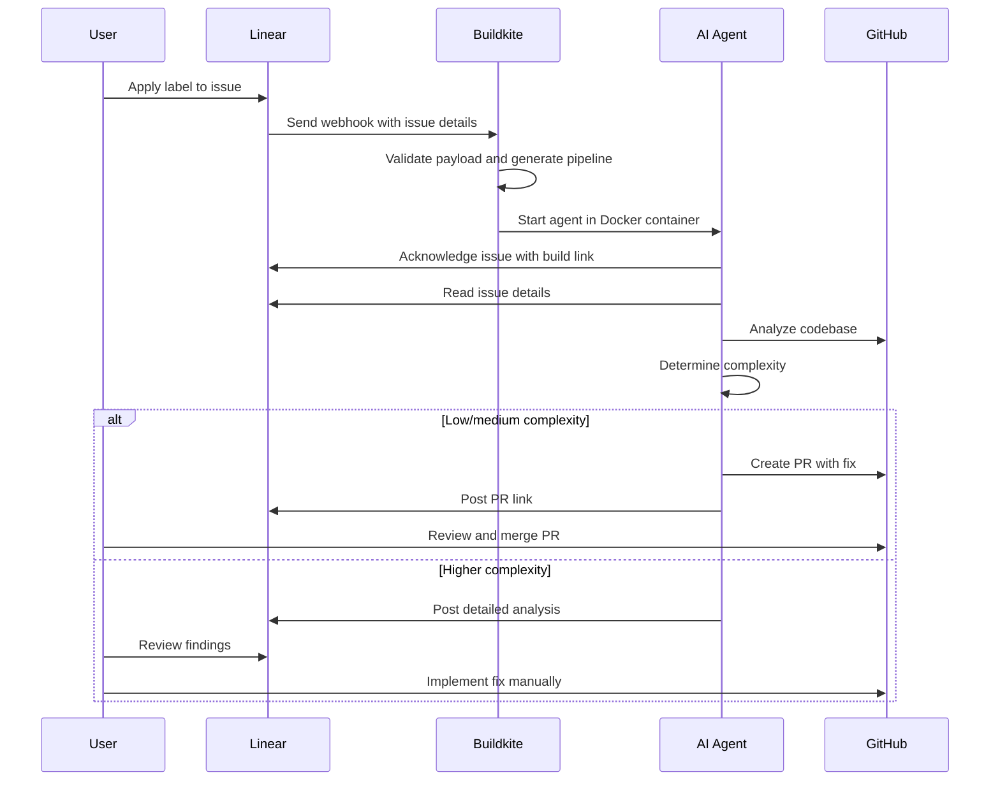

# Buildkite Agentic Pipeline Example: Linear Issue Handler

A [Buildkite](https://buildkite.com) pipeline that uses [Claude Code](https://docs.claude.com/en/docs/claude-code/overview) and Buildkite model providers to diagnose and fix [Linear](https://linear.app/) issues.

## Setting up

### Step 1: Start with an existing Linear workspace

Make sure you have access to a Linear [workspace](https://linear.app/docs/workspaces) that allows you to create and manage [webhooks](https://linear.app/docs/api-and-webhooks).

### Step 2: Prepare your agentic pipeline

1. [Create a new GitHub repository](https://github.com/new?template_name=buildkite-agentic-linear-issue-example&template_owner=cnunciato) using this repository as a template.
1. [Create a new Buildkite pipeline](https://buildkite.com/organizations/~/pipelines/new) for your newly templated repository with a Linux [hosted agents](https://buildkite.com/docs/pipelines/hosted-agents) cluster.
1. [Create a new pipeline trigger](https://buildkite.com/~/buildkite-agentic-linear-issue-example/settings/triggers/new?trigger_type=webhook) for the pipeline, then copy the generated webhook URL to your clipboard.
1. On the **Settings** > **API** page of your Linear workspace, add a new Linear webhook, paste your Buildkite webhook URL into the URL field, choose **Issues** (under **Data change events**), and save.
1. Create three new [Buildkite secrets](https://buildkite.com/docs/pipelines/security/secrets/buildkite-secrets) with the following names:
   1. `GITHUB_TOKEN`: A GitHub [personal access token](https://docs.github.com/en/authentication/keeping-your-account-and-data-secure/managing-your-personal-access-tokens) with `repo` and `pull_request` read/write scopes.
   1. `LINEAR_API_TOKEN`: A Linear [API key](https://linear.app/docs/api-and-webhooks) with "Read" permissions.
   1. `API_TOKEN_BUILDKITE`: A Buildkite [API access token](https://buildkite.com/docs/apis/managing-api-tokens) with `read_builds`, `read_build_logs`, and `read_pipelines` permissions.

### Step 3: Trigger the pipeline

1. Create a new issue Linear describing the work to be done. Label the issue with `buildkite-analyze`. (This label is configurable in `.buildkite/pipeline.yml`.)
1. In a few moments, you should see a new comment appear on the issue confirming the agent's picked up the task. Follow the link to the Buildkite dashboard to have a look.
1. Once the agent determines a fix, you should see a new PR submitted on the associated GitHub repository explaining what was done. Have a look at that PR, and if it looks good, approve and merge.

That's it! Your issue should now be addressed. :tada:

## How it works

The pipeline listens for webhooks originating from Linear issue events. When a new issue is detected, the pipeline runs the `handler` script, which adds a step to the running pipeline that uses Claude to diagnose and fix the issue, [annotating](https://buildkite.com/docs/apis/rest-api/annotations) the Buildkite build as it goes. When the work is complete, Claude commits the changes to a new feature branch on the associated GitHub repository, submits a new PR, and reports back on the Linear issue with a summary.

The following diagram shows the high-level flow, beginning with the Linear issue label:

### Step summary

1. User applies a `buildkite-analyze` label to a Linear issue.
1. Linear sends a webhook notification to Buildkite with issue details, triggering the pipeline.
1. Pipeline evaluates the webhook payload and conditionally adds a step to the running pipeline to launch Claude. pipeline dynamically.
1. In a Docker containerm Claude reads the issue, analyzes the codebase, and determines a course of action:
   - For simpler issues, it creates a fix and submits a PR to GitHub.
   - For more complex issues, it documents its findings and posts an analysis back to Linear.
